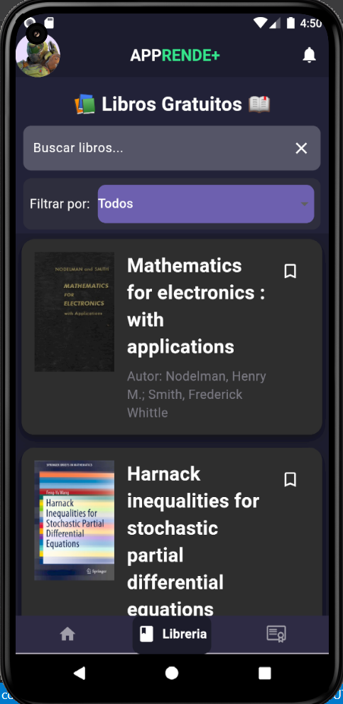
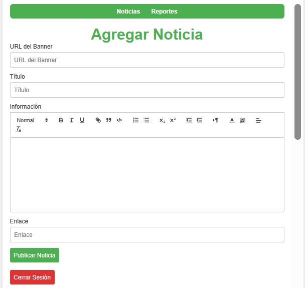

# APPrende+
[](https://flutter.dev/) [](https://firebase.google.com/) [](https://dart.dev/) [](https://developer.mozilla.org/en-US/docs/Web/JavaScript) [](https://developer.mozilla.org/en-US/docs/Web/HTML) [](https://developer.mozilla.org/en-US/docs/Web/CSS)

[English](#english) | [Español](#español)

---
## English

### Overview

APPrende+ is an educational platform that provides users with access to free courses, books, and news. The project includes a mobile application developed with Flutter and a web administration page for managing course announcements.
### Features

- User authentication with Firebase  
- Management of course announcements and courses  
- Intuitive and modern user interface  
- Integration with external APIs for content  
- Web page for course announcement administration (add, edit, delete) for administrators  
### Screenshots

  
  
  
  
  
### Getting Started

#### Prerequisites

- Flutter SDK: [Install Flutter](https://flutter.dev/docs/get-started/install)  
- Firebase account: [Create Firebase Project](https://firebase.google.com/)  

#### Cloning the Repository

```sh
git clone https://github.com/tu-usuario/APPS_BOOKS_2024.git
cd APPS_BOOKS_2024
```
### Firebase Integration

The project uses Firebase for user authentication and Firestore for database management. Follow these steps to set up Firebase correctly:

#### Setting Up Firebase

1. **Install Required Tools**
   - Install the Flutter SDK: [Install Flutter](https://flutter.dev/docs/get-started/install)
   - Install the Firebase CLI: [Install Firebase CLI](https://firebase.google.com/docs/cli#install_the_firebase_cli)
   - Install the FlutterFire CLI: 
     ```sh
     dart pub global activate flutterfire_cli
     ```

2. **Create a Firebase Project**
   - Go to the [Firebase Console](https://console.firebase.google.com/) and create a new project.

3. **Configure Firebase for Your Flutter App**
   - From the root directory of your Flutter project, run:
     ```sh
     flutterfire configure
     ```
   - This command will guide you through the process of setting up Firebase for your Flutter app, including registering your app with Firebase and generating the `firebase_options.dart` file.

4. **Initialize Firebase in Your Flutter App**
   - Open the [main.dart](http://_vscodecontentref_/0) file and import the necessary Firebase packages:
     ```dart
     import 'package:firebase_core/firebase_core.dart';
     import 'firebase_options.dart';
     ```
   - Initialize Firebase in the `main` function:
     ```dart
     void main() async {
       WidgetsFlutterBinding.ensureInitialized();
       await Firebase.initializeApp(
         options: DefaultFirebaseOptions.currentPlatform,
       );
       runApp(const MyApp());
     }
     ```

5. **Add Firebase Plugins**
   - Add the required Firebase plugins to your Flutter project. For example, to add Firebase Authentication and Firestore:
     ```sh
     flutter pub add firebase_auth
     flutter pub add cloud_firestore
     ```
   - Ensure your Firebase configuration is up to date:
     ```sh
     flutterfire configure
     ```

6. **Rebuild Your Flutter App**
   - Rebuild your Flutter app to apply the changes:
     ```sh
     flutter run
     ```

7. **Optional: Use Firebase Emulator for Testing**
   - If you prefer to use a demo project for testing, initialize Firebase with a demo project ID:
     ```dart
     await Firebase.initializeApp(
       demoProjectId: "demo-project-id",
     );
     ```

### Additional Resources

- [Firebase Setup Documentation](https://firebase.google.com/docs/flutter/setup?hl=es-419&platform=android)
- [Firebase Console](https://console.firebase.google.com/?hl=es-419) 

#### Running the Mobile Application

```sh
flutter pub get
flutter run
```

#### Running the Web Administration Page

1. Navigate to the `web` directory.  
2. Open `index.html` in a web browser.  

### Project Structure
```
APPS_BOOKS_2024/
├── .dart_tool/
├── .flutter-plugins
├── .flutter-plugins-dependencies
├── .gitattributes
├── .gitignore
├── .metadata
├── .vscode/
│   └── settings.json
├── analysis_options.yaml
├── android/
│   ├── app/
│   └── build.gradle
├── assets/
│   └── screenshots/
│       ├── Add_news_page.png
│       ├── Books_page.png
│       ├── Courses_page.png
│       ├── Homepage.png
│       └── User_page.png
├── build/
├── firebase.json
├── ios/
│   └── Runner/
│       └── Info.plist
├── lib/
│   ├── main.dart                   # Main entry point of the Flutter app
│   ├── model/
│   │   └── course.dart             # Course model
│   ├── services/
│   │   ├── annas_archive_api.dart  # API service for books
│   │   └── course_service.dart     # API service for courses
│   ├── src/
│   │   └── pages/
│   │       ├── HomePage/
│   │       │   ├── HomePage.dart   # Main HomePage with tabs
│   │       │   ├── Login.dart      # Login page
│   │       │   └── widgets/
│   │       │       ├── CustomAppBar.dart
│   │       │       ├── UserPageConfig/
│   │       │       │   ├── ProfileCard.dart
│   │       │       │   ├── CategoryButtons.dart
│   │       │       │   ├── SwitchButtons.dart
│   │       │       │   ├── CoursesContainer.dart
│   │       │       │   ├── LibraryContainer.dart
│   │       │       │   ├── add_news.dart
│   │       │       │   ├── admin_settings_page.dart
│   │       │       │   └── user_management.dart
│   │       │       ├── DetalleNoticiaPage.dart
│   │       │       ├── DetalleLibroPage.dart
│   │       │       ├── course_detail_page.dart
│   │       │       ├── tabs/
│   │       │       │   ├── Principal.dart
│   │       │       │   ├── FreeCoursesPage.dart
│   │       │       │   └── libros.dart
│   │       │       └── UserPage.dart # User page with profile and settings
├── linux/
├── macos/
├── pubspec.lock
├── pubspec.yaml
├── README.md
├── test/
├── web/
│   ├── add_news.js                 # JavaScript for adding news
│   ├── index.html                  # HTML for the web admin page
│   └── styles.css                  # CSS for the web admin page
└── windows/
```

### API Integration

The project integrates with an external API to fetch courses with 100% discount coupons. Special thanks to [Huythanh0x](https://github.com/Huythanh0x) for providing the API. Check out the repository [here](https://github.com/Huythanh0x/udemy_coupon_server_java_spring).

Additionally, the project uses [Anna's Archive API](https://rapidapi.com/tribestick-tribestick-default/api/annas-archive-api) for retrieving books. 


### Web Administration Page

The web administration page allows administrators to manage course announcements. Administrators can add, edit, and delete announcements. The page is built using HTML, CSS, and JavaScript, and it integrates with Firebase for authentication and Firestore for database management.

### Credits

- **100% coupon course API**: Special thanks to [Huythanh0x](https://github.com/Huythanh0x) for providing the API. Check out the repository [here](https://github.com/Huythanh0x/udemy_coupon_server_java_spring).  
- **Anna's Archive API**: The project uses [Anna's Archive API](https://rapidapi.com/tribestick-tribestick-default/api/annas-archive-api) to retrieve books.  

### License

This project is licensed under the MIT License - see the LICENSE file for details.


## Español

### Descripción

APPrende+ es una plataforma educativa que brinda a los usuarios acceso a cursos gratuitos, libros y anuncios de cursos nuevos. El proyecto incluye una aplicación móvil desarrollada con Flutter y una página web de administración para gestionar anuncios de cursos.

### Características

- Autenticación de usuarios con Firebase  
- Gestión de anuncios de cursos y cursos  
- Interfaz de usuario intuitiva y moderna  
- Integración con APIs externas para contenido  
- Página web para la administración de anuncios de cursos (agregar, editar, eliminar) para administradores  

### Capturas de Pantalla

  
  
  
  
  

### Comenzando

#### Requisitos Previos

- Flutter SDK: [Instalar Flutter](https://flutter.dev/docs/get-started/install)  
- Cuenta Firebase: [Crear Proyecto Firebase](https://firebase.google.com/)  

#### Clonar el Repositorio

```sh
git clone https://github.com/tu-usuario/APPS_BOOKS_2024.git
cd APPS_BOOKS_2024
```
### Integración de Firebase

El proyecto utiliza Firebase para la autenticación de usuarios y Firestore para la gestión de la base de datos. Sigue estos pasos para configurar Firebase correctamente:

#### Configurando Firebase

1. **Instalar Herramientas Requeridas**
   - Instala el SDK de Flutter: [Instalar Flutter](https://flutter.dev/docs/get-started/install)
   - Instala la CLI de Firebase: [Instalar Firebase CLI](https://firebase.google.com/docs/cli#install_the_firebase_cli)
   - Instala la CLI de FlutterFire: 
     ```sh
     dart pub global activate flutterfire_cli
     ```

2. **Crear un Proyecto de Firebase**
   - Ve a la [Consola de Firebase](https://console.firebase.google.com/) y crea un nuevo proyecto.

3. **Configurar Firebase para tu App de Flutter**
   - Desde el directorio raíz de tu proyecto de Flutter, ejecuta:
     ```sh
     flutterfire configure
     ```
   - Este comando te guiará a través del proceso de configuración de Firebase para tu app de Flutter, incluyendo el registro de tu app con Firebase y la generación del archivo `firebase_options.dart`.

4. **Inicializar Firebase en tu App de Flutter**
   - Abre el archivo  y importa los paquetes necesarios de Firebase:
     ```dart
     import 'package:firebase_core/firebase_core.dart';
     import 'firebase_options.dart';
     ```
   - Inicializa Firebase en la función `main`:
     ```dart
     void main() async {
       WidgetsFlutterBinding.ensureInitialized();
       await Firebase.initializeApp(
         options: DefaultFirebaseOptions.currentPlatform,
       );
       runApp(const MyApp());
     }
     ```

5. **Agregar Complementos de Firebase**
   - Agrega los complementos de Firebase requeridos a tu proyecto de Flutter. Por ejemplo, para agregar Firebase Authentication y Firestore:
     ```sh
     flutter pub add firebase_auth
     flutter pub add cloud_firestore
     ```
   - Asegúrate de que tu configuración de Firebase esté actualizada:
     ```sh
     flutterfire configure
     ```

6. **Reconstruir tu App de Flutter**
   - Reconstruye tu app de Flutter para aplicar los cambios:
     ```sh
     flutter run
     ```

7. **Opcional: Usar el Emulador de Firebase para Pruebas**
   - Si prefieres usar un proyecto de demostración para pruebas, inicializa Firebase con un ID de proyecto de demostración:
     ```dart
     await Firebase.initializeApp(
       demoProjectId: "demo-project-id",
     );
     ```

### Recursos Adicionales

- [Documentación de Configuración de Firebase](https://firebase.google.com/docs/flutter/setup?hl=es-419&platform=android)
- [Consola de Firebase](https://console.firebase.google.com/?hl=es-419)

#### Ejecutar la Aplicación Móvil

```sh
flutter pub get
flutter run
```

#### Ejecutar la Página Web de Administración

1. Navega al directorio `web`.  
2. Abre `index.html` en un navegador web.  

### Estructura del Proyecto
```
APPS_BOOKS_2024/
├── .dart_tool/
├── .flutter-plugins
├── .flutter-plugins-dependencies
├── .gitattributes
├── .gitignore
├── .metadata
├── .vscode/
│   └── settings.json
├── analysis_options.yaml
├── android/
│   ├── app/
│   └── build.gradle
├── assets/
│   └── screenshots/
│       ├── Add_news_page.png
│       ├── Books_page.png
│       ├── Courses_page.png
│       ├── Homepage.png
│       └── User_page.png
├── build/
├── firebase.json
├── ios/
│   └── Runner/
│       └── Info.plist
├── lib/
│   ├── main.dart                   # Entrada principal a la aplicación
│   ├── model/
│   │   └── course.dart             # Modelo de Cursos
│   ├── services/
│   │   ├── annas_archive_api.dart  # Servicio de APIs para libros
│   │   └── course_service.dart     # Servicio de APIs para cursos
│   ├── src/
│   │   └── pages/
│   │       ├── HomePage/
│   │       │   ├── HomePage.dart   # Menú principal
│   │       │   ├── Login.dart      # Página de Login
│   │       │   └── widgets/
│   │       │       ├── CustomAppBar.dart
│   │       │       ├── UserPageConfig/
│   │       │       │   ├── ProfileCard.dart
│   │       │       │   ├── CategoryButtons.dart
│   │       │       │   ├── SwitchButtons.dart
│   │       │       │   ├── CoursesContainer.dart
│   │       │       │   ├── LibraryContainer.dart
│   │       │       │   ├── add_news.dart
│   │       │       │   ├── admin_settings_page.dart
│   │       │       │   └── user_management.dart
│   │       │       ├── DetalleNoticiaPage.dart
│   │       │       ├── DetalleLibroPage.dart
│   │       │       ├── course_detail_page.dart
│   │       │       ├── tabs/
│   │       │       │   ├── Principal.dart 
│   │       │       │   ├── FreeCoursesPage.dart
│   │       │       │   └── libros.dart
│   │       │       └── UserPage.dart # Página del usuario y config.
├── linux/
├── macos/
├── pubspec.lock
├── pubspec.yaml
├── README.md
├── test/
├── web/
│   ├── add_news.js                 # JavaScript para agregar noticias.
│   ├── index.html                  # HTML para la web del administrador.
│   └── styles.css                  # CSS para estilos de la web.
└── windows/
```

### Integración de API

El proyecto se integra con una API externa para obtener cursos con cupones de descuento del 100%. Un agradecimiento especial a [Huythanh0x](https://github.com/Huythanh0x) por proporcionar la API. Consulta el repositorio [aquí](https://github.com/Huythanh0x/udemy_coupon_server_java_spring).

Además, el proyecto utiliza la [API de Anna's Archive](https://rapidapi.com/tribestick-tribestick-default/api/annas-archive-api) para obtener libros.

### Página Web de Administración

La página web de administración permite a los administradores gestionar anuncios de cursos. Los administradores pueden agregar, editar y eliminar anuncios. La página está construida utilizando HTML, CSS y JavaScript, y se integra con Firebase para la autenticación y Firestore para la gestión de la base de datos.

### Créditos

- **API de cursos con cupón del 100%**: Gracias a [Huythanh0x](https://github.com/Huythanh0x) por proporcionar la API. revisa su repositorio [aquí](https://github.com/Huythanh0x/udemy_coupon_server_java_spring).  
- **API de Anna's Archive**: El proyecto utiliza la [API de Anna's Archive](https://rapidapi.com/tribestick-tribestick-default/api/annas-archive-api) para obtener libros.  

### Licencia

Este proyecto está licenciado bajo la Licencia MIT - consulta el archivo LICENSE para más detalles.
